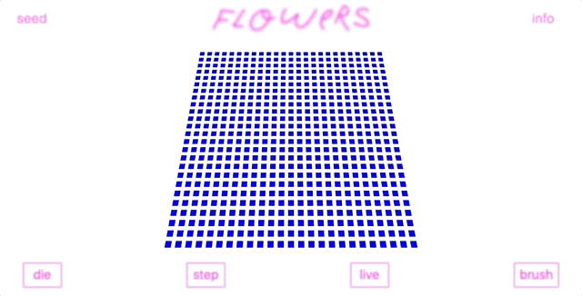

# Flowers
A simulator of
[Conway's Game of Life](https://en.wikipedia.org/wiki/Conway%27s_Game_of_Life)

[live](https://collinclarke.github.io/flowers/)

#### Place seeds and observe the outcome

*You can click on squares in a gridded flower patch to place a seed.
On pressing play, the logic of Conway's GOL dictates the growth and death of your flower patch.*



#### Use the brush tool to draw Life

*Click and drag to draw or move the camera. Zoom with the scroll wheel*


## How it works

Flowers uses an experimental library called React Three Renderer to render the 3JS scene. This allows for 3js elements to be declared in JSX form. Internal component state dictates the height of each block. Each time a block lives, it increments its internal "life" counter, growing in size. A block that is no longer living will slowly shrink to half of the height it obtained during life.

When blocks have lived long enough their color picker begins to sample a variety of reds, turning it into a flower.

```Javascript

calculateColor() {
  const { flower } = this.props;

  const colorConversion = (idx) => {
    switch(idx) {
      case 0:
       return 14;
      case 1:
       return (135 + Math.floor(Math.random() * 50));
      case 2:
       return (93 + Math.floor(Math.random() * 25));
    }
  }

  let r = colorConversion(0);
  let g = colorConversion(1);
  let b = colorConversion(2);

  this.livingColor = [r, g, b]

  if (this.life > 5) {
    r = Math.floor(Math.random() * 155 + 150);
    g = Math.floor(Math.random() * 100);
    b = Math.floor(Math.random() * 100 + 50);
  }
  return `rgb( ${r}, ${g}, ${b} )`
}

```

The logic of game of life is contained in a single Javascript class. This class holds the game state and is referenced by the React components to determine if they should live or die in this cycle.

```Javascript

calculateLife (x, y) {
  const neighbors = this.findNeighbors(x, y);
  const living = this.grid[x][y];
  if (living) {
    if (![2, 3].includes(neighbors)) {
      this.nextGrid[x][y] = false;
    } else {
      this.nextGrid[x][y] = true;
    }
  } else {
    if (neighbors === 3) {
      this.nextGrid[x][y] = true;
    } else {
      this.nextGrid[x][y] = false;
    }
  }
}

```

Effects over time are handled internally by the components.

```JavaScript
const max = Math.floor(this.maxLife / 2)

if (this.props.living) {
  color = this.calculateColor();
  if (this.life < 10 && !(this.state.dragging))
    this.life += .075;
  if (this.props.flower > Math.pow(10, 10)) {
    this.life += .075;
  }
} else if (this.state.hovered) {
  color = this.hoverColor;
} else {
  color = this.color;
  if (this.life > this.maxLife) {
    this.maxLife = this.life;
  }
  if (this.life > max) {
    this.life -= .05;
  }
}

```

## Technologies / Libraries / APIs

[react three](https://github.com/Izzimach/react-three)

[react three renderer](https://github.com/toxicFork/react-three-renderer)

[three.js](https://threejs.org/)

[react](https://github.com/facebook/react)
